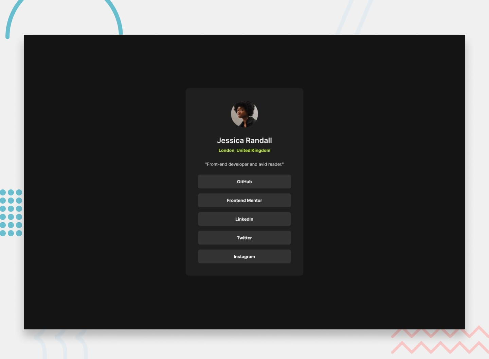

# 🌐 Social Link Profile - Frontend Mentor  
  Un componente de tarjeta de perfil con enlaces sociales que muestra mi perfil con los enlaces a redes sociales. El diseño presenta una apariencia limpia y minimalista con una tipografía clara.

🔗 **[Live Demo](https://social-link-profile-main-jy66.vercel.app/)**  
🔗 **[Solution Demo](https://www.frontendmentor.io/solutions/social-link-profile-cX7wx-fbt1)**  

## 🛠️ Tecnologías usadas  
- **HTML5** - Estructura y contenido de la página.
- **CSS3** – Estilado y diseño con Flexbox para responsividad.

## 🚀 Cómo ejecutar el proyecto localmente
1. Clona el repositorio:  
    ```bash
    git clone https://github.com/rocioizq/social-link-profile-main.git
    ```  
2. Navegá a la carpeta del proyecto: 
    ```bash
    cd social-link-profile-main
    ```  
3. Abrí el archivo index.html en tu navegador.

## 📷 Capturas de pantallas 
  
